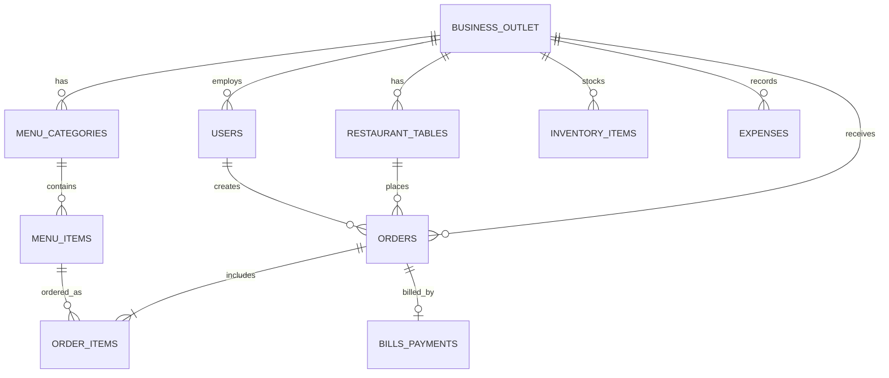

# ER Diagram (Mermaid — renders in GitHub and VS Code preview)

```mermaid
erDiagram
  BUSINESS_OUTLET ||--o{ USERS : employs
  BUSINESS_OUTLET ||--o{ RESTAURANT_TABLES : has
  BUSINESS_OUTLET ||--o{ MENU_CATEGORIES : has
  BUSINESS_OUTLET ||--o{ ORDERS : receives
  BUSINESS_OUTLET ||--o{ INVENTORY_ITEMS : stocks
  BUSINESS_OUTLET ||--o{ EXPENSES : records
  MENU_CATEGORIES ||--o{ MENU_ITEMS : contains
  RESTAURANT_TABLES ||--o{ ORDERS : places
  USERS ||--o{ ORDERS : creates
  ORDERS ||--|{ ORDER_ITEMS : includes
  MENU_ITEMS ||--o{ ORDER_ITEMS : ordered_as
  ORDERS ||--o| BILLS_PAYMENTS : billed_by
```
Full columns with primary and foreign keys: `schema.sql`.
